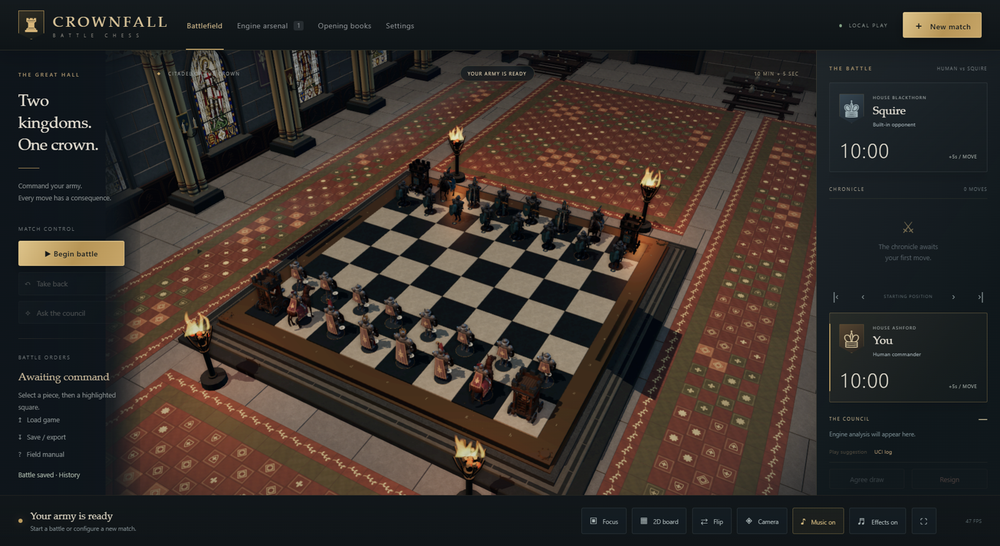
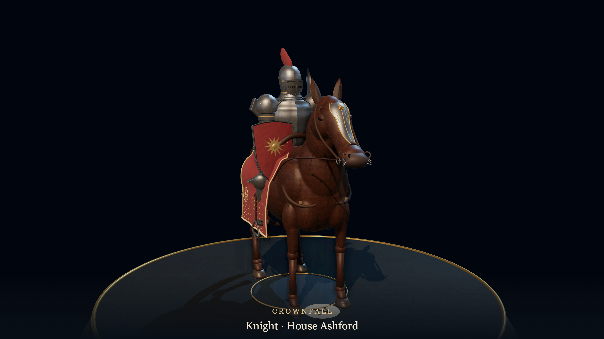
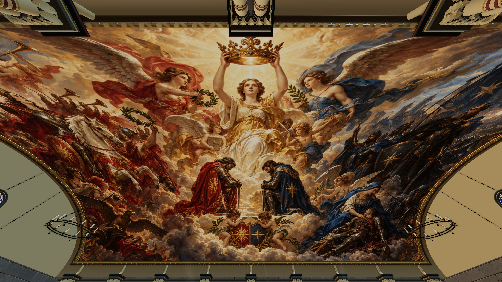

# Crownfall — Battle Chess

## Startup repair — packaging revision 2

The first public download omitted `WebView2Loader.dll`, a required Microsoft component. This revision includes the signed x64 DLL and an updated installation manifest. The game executable and gameplay assets are unchanged.

If you already downloaded the original 0.36.0 beta, use [the small startup repair](https://github.com/saintlouischess-eng/Crownfall/releases/download/v0.36.0-beta.2/Crownfall-0.36.0-Startup-Repair.zip). Close Crownfall and extract the repair into the folder containing `Crownfall.exe`, allowing its installation manifest to be replaced. Saved games and settings are preserved. Then run `Crownfall.exe` again.

Microsoft Edge WebView2 Runtime is still required. Installing that Runtime alone does not replace Crownfall's missing loader DLL.

**Windows x64 · 0.36.0 public beta · Local play · UCI engines**

**A fast, modern dedicated GPU is needed for smooth animations.** Crownfall renders a detailed 3D hall, animated armies and cinematic combat. Lower quality settings help, but do not make this a lightweight chess GUI.

## Download and play

**[Download Crownfall for Windows x64](https://github.com/saintlouischess-eng/Crownfall/releases/download/v0.36.0-beta.2/Crownfall-Windows-x64.zip)** · [Release notes and checksums](https://github.com/saintlouischess-eng/Crownfall/releases/tag/v0.36.0-beta.2)

1. Download **Crownfall-Windows-x64.zip** from the release assets.
2. Extract the complete ZIP into a writable folder. Keep the executable and its `web` resources together; do not launch from inside the ZIP.
3. Run **Crownfall.exe**, choose **New battle**, select your players and time control, and begin.
4. Optionally run **Install-Crownfall.cmd** to install for your Windows account or update an existing installation while preserving its `data` folder.

The package includes .NET and requires [Microsoft Edge WebView2 Runtime](https://developer.microsoft.com/en-us/microsoft-edge/webview2/). Once installed, local play with the built-in opponent needs no account or internet connection.

## Two kingdoms. One crown.

Play chess in a decorated great hall where armored troops move, react and fight. Captures become cinematic exchanges, and each army's fallen are carried to separate memorial rows. Explore the hall's painted ceiling and twenty-one distinct stained-glass windows, or keep a compact 2D board beside the action.

- **Human versus human, human versus engine, or engine versus engine** on one computer. Squire is included as a lightweight built-in opponent.
- **Windows UCI engine support**, including all five standard option types, engine profiles, analysis and Polyglot / PGN opening books. External engines and books are supplied separately.
- **Flexible time controls:** increment, sudden death, US and Bronstein delay, tournament stages, fixed move time, depth/nodes, untimed play, Japanese byo-yomi and Canadian overtime.
- **Animated medieval armies:** cavalry, occupied siege rooks, reactions, taunts, capture choreography, recovery teams and persistent battlefield blood.
- **Movable, resizable and independently flippable 2D board**, save history, PGN/FEN import and export, and photo mode.
- **Twenty original orchestral tracks**, about 62 minutes of music, shuffled as complete tracks without capture-triggered changes.
- **Adjustable hall lighting up to 500%**, independent sunbeam/shadow switches and optional HDR with brightness calibration.

## Before you start

This is a **graphics-intensive public beta**. The tested computer uses an **RTX 5080**; minimum GPU specifications and performance on other computers are not established. Start with Low or Medium in SDR for smoother animation. See [hardware requirements and measured frame rates](SYSTEM_REQUIREMENTS.md).

Controls, engines, books, updates and troubleshooting are covered in the [Player guide](PLAYER_GUIDE.md). Arrow keys travel through the hall; Page Up / Down changes height; Home returns to the board. Space pauses/resumes or skips an animation. Camera → Free flight enables right-drag looking, W A S D travel and E / Q height controls.

The beta supports local play and standard chess. Online multiplayer, Chess960, pondering and tournament management are not included. HDR, wide resolutions and higher graphics settings have a significant performance cost. The Windows application is unsigned.

## Feedback

[Report a problem](https://github.com/saintlouischess-eng/Crownfall/issues/new?template=bug_report.yml). Include the game version, GPU, graphics preset, HDR setting and steps to reproduce. In-game **Settings → Diagnostics** exports a report locally; nothing uploads automatically. Review attachments before posting and keep personal engine paths and saved games private.

## Distribution and credits

This repository hosts player documentation, screenshots and finished-game downloads. **The Crownfall source project is not published, and no open-source license is granted for the original game.** Required runtime resources are included with the playable package. Third-party components retain the terms in the included `licenses` folder. See [Credits](CREDITS.md).

GitHub automatically labels repository snapshots as “Source code”; those snapshots contain only this documentation and the screenshots. To play, download **Crownfall-Windows-x64.zip** from the release assets.
